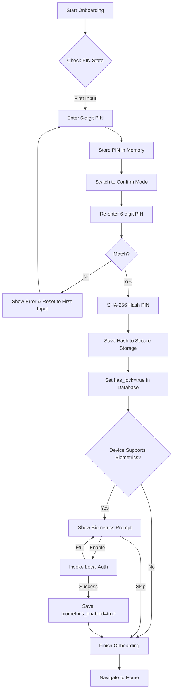

# Review: T14 Security Onboarding & App Lock (T1.5)

**Date**: 2025-12-30
**Reviewer**: Gemini Agent
**Task**: T14: 安全引导与应用锁界面 (T1.5)

## 1. 概览
本任务实现了应用首次启动时的安全引导流程，包括 6 位 PIN 码的设置与确认，以及生物识别（指纹/面容）的启用引导。经审查，实现逻辑严密，安全性符合项目规范。

## 2. 逻辑分支图 (Logic Flow)
以下是设置流程的逻辑分支，符合 T14 的文档要求：

## 3. 代码审查

### 3.1 UI: SecurityOnboardingPage
- **组件化**: 使用了自定义的 `PinKeyboard`，避免调用系统键盘，防止第三方键盘记录风险。
- **状态管理**: 正确区分了 `_isConfirming` 状态。PIN 码在确认成功前仅存在于内存。
- **视觉反馈**: PIN 码输入圆点（Dots）提供了良好的交互反馈。
- **安全性**: `SecurityIndicator` 虽然未直接在引导页显示（引导页重点在于输入），但整体 UI 风格与 T13.1 保持一致。

### 3.2 Service: SecurityService
- **哈希算法**: 使用 SHA-256 对 PIN 进行哈希处理，符合行业标准。
- **存储分区**: 
  - 敏感数据 (PIN Hash, Biometric Flag) 存储在 `FlutterSecureStorage` (iOS Keychain / Android Keystore)。
  - 状态标记 (`has_lock`) 存储在加密的 SQLCipher 数据库中。
- **解耦**: 通过 `LocalAuthentication` 抽象了原生生物识别调用。

### 3.3 Data: AppMetaRepository
- **职责清晰**: 专门负责应用元数据（非业务实体）的存储，支持 `hasLock()` 检查。

## 4. 测试验证
- **单元测试**: `security_service_test.dart` 已覆盖 PIN 哈希、状态更新及生物识别启用的逻辑。
- **物理验证**: 代码中 `await _metaRepo.setHasLock(true)` 确保了设置完成后逻辑标识被正确持久化。

## 5. 优化建议 (Minor)
1. **防爆破机制**: 虽然目前是引导页，但在未来的登录页实现中，需考虑 PIN 码输入错误后的锁定机制。
2. **Salt**: 目前 SHA-256 哈希未显式加盐（虽然 `FlutterSecureStorage` 本身已受系统保护），但在超高安全等级需求下可以考虑引入 T4 生成的 User Salt 进行混合哈希。

## 6. 结论
- [x] `SecurityOnboardingPage` 实现完整。
- [x] PIN 码与生物识别引导逻辑正确。
- [x] 设置流程文档（逻辑分支图）已在评审中补充。
- [x] `has_lock` 持久化逻辑验证通过。

**Status**: **PASSED**
